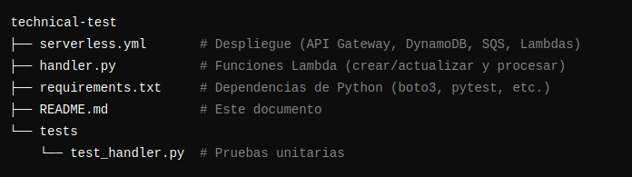

# Solución Completa - Prueba Técnica Serverless (AWS)

Este **README** contiene **toda** la información solicitada para la prueba técnica:  
- Descripción y objetivos del proyecto.  
- Diagrama de arquitectura.  
- Decisiones técnicas.  
- Guía paso a paso de despliegue y ejecución.  
- Uso de la API.  
- Pruebas (tests).  
- Código funcional (serverless.yml, handler.py y test_handler.py) integrado en el mismo documento.  
- Posibles mejoras y escalabilidad.

---

## Tabla de Contenidos

1. [1. Introducción y Objetivos](#1-introducción-y-objetivos)  
2. [2. Arquitectura General](#2-arquitectura-general)  
   - [2.1 Diagrama](#21-diagrama)  
3. [3. Decisiones Técnicas](#3-decisiones-técnicas)  
4. [4. Estructura de Archivos](#4-estructura-de-archivos)  
5. [5. Guía de Despliegue Completa](#5-guía-de-despliegue-completa)  
   - [5.1 Configurar Credenciales de AWS](#51-configurar-credenciales-de-aws)  
   - [5.2 Instalar Dependencias (Python)](#52-instalar-dependencias-python)  
   - [5.3 Desplegar con Serverless Framework](#53-desplegar-con-serverless-framework)  
   - [5.4 Actualizar las URLs de las Colas SQS](#54-actualizar-las-urls-de-las-colas-sqs)  
   - [5.5 (Opcional) Ejecución Local (Offline)](#55-opcional-ejecución-local-offline)  
6. [6. Uso de la API](#6-uso-de-la-api)  
   - [6.1 Crear una Orden (POST)](#61-crear-una-orden-post)  
   - [6.2 Actualizar una Orden (PUT)](#62-actualizar-una-orden-put)  
7. [7. Pruebas (Tests)](#7-pruebas-tests)  
8. [8. Escalabilidad y Mejoras Futuras](#8-escalabilidad-y-mejoras-futuras)  
9. [9. Código Funcional](#9-código-funcional)  
   - [9.1 serverless.yml](#91-serverlessyml)  
   - [9.2 handler.py](#92-handlerpy)  
   - [9.3 tests/test_handler.py](#93-teststest_handlerpy)  
10. [10. Creación de Repositorio en GitHub (Guía)](#10-creación-de-repositorio-en-github-guía)  
11. [11. Conclusiones](#11-conclusiones)


---

## 1. Introducción y Objetivos

Esta solución **serverless** se diseñó para una **prueba técnica** enfocada en procesar órdenes de un servicio técnico. El sistema debe:

1. **Recibir** órdenes vía API (métodos REST).  
2. **Almacenar** los datos en una base de datos NoSQL (DynamoDB).  
3. **Encolar** las órdenes en una cola de mensajes (SQS) según el estado (received, inprocess, completed, canceled).  
4. **Procesar** las órdenes asíncronamente a través de funciones Lambda especializadas.

El objetivo es demostrar un **flujo escalable** y **desacoplado** que aproveche los servicios administrados de **AWS**.

---

## 2. Arquitectura General

La arquitectura propuesta se basa en los siguientes componentes de AWS:

1. **Amazon API Gateway**: Expone la API REST (endpoints `/orders`, `/orders/{orderId}`).  
2. **AWS Lambda** (Función principal):  
   - Valida la orden.  
   - Guarda/actualiza en **DynamoDB**.  
   - Envía un mensaje a **SQS** según el estado de la orden.  
3. **Amazon DynamoDB**: Base de datos NoSQL para almacenar los datos de cada orden.  
4. **Amazon SQS**: Colas independientes para cada estado de la orden.  
5. **AWS Lambda** (Funciones de procesamiento): Al llegar un mensaje a cada cola, se activa automáticamente la Lambda correspondiente para ese estado.

### 2.1 Diagrama

```plaintext
┌───────────────┐
│ API Gateway   │  (Endpoints: POST /orders, PUT /orders/{orderId})
└──────┬────────┘
       ▼
  ┌───────────────────┐
  │ Lambda create/    │
  │ update (handler)  │
  └──────┬────────────┘
         │
         ▼
┌─────────────────────┐
│ DynamoDB - Table    │
│ "Orders"            │
└──────┬──────────────┘
       ▼
┌───────────────────────┐
│ SQS (cola por estado) │
└──────┬────────────────┘
       ▼
┌───────────────────────┐
│ Lambdas procesadoras  │
│ (una por estado)      │
└───────────────────────┘

```
### 3. Decisiones Técnicas

1.- Python 3.9

Uso de boto3 para integrar con AWS.
Facilidad para escribir y testear funciones Lambda.

2.- Serverless Framework

Permite definir la infraestructura (API Gateway, DynamoDB, SQS, IAM, etc.) en un solo archivo (serverless.yml).
Simplifica el despliegue a AWS.

3.- DynamoDB

Base de datos NoSQL con escalado automático y modelo de pago por solicitud.
Tablas flexibles para almacenar la información de las órdenes.

4.-  SQS

Se crea una cola por estado para un manejo desacoplado y claro.
Cada Lambda procesadora maneja un estado diferente.

5.- Separación de Funciones

Una función Lambda para la parte de API (crear / actualizar órdenes).
Varias funciones Lambda para el consumo de las colas (cada estado se procesa por separado).


### 4. Estructura de Archivos

Aquí se muestra el ejemplo de código en imagen:



